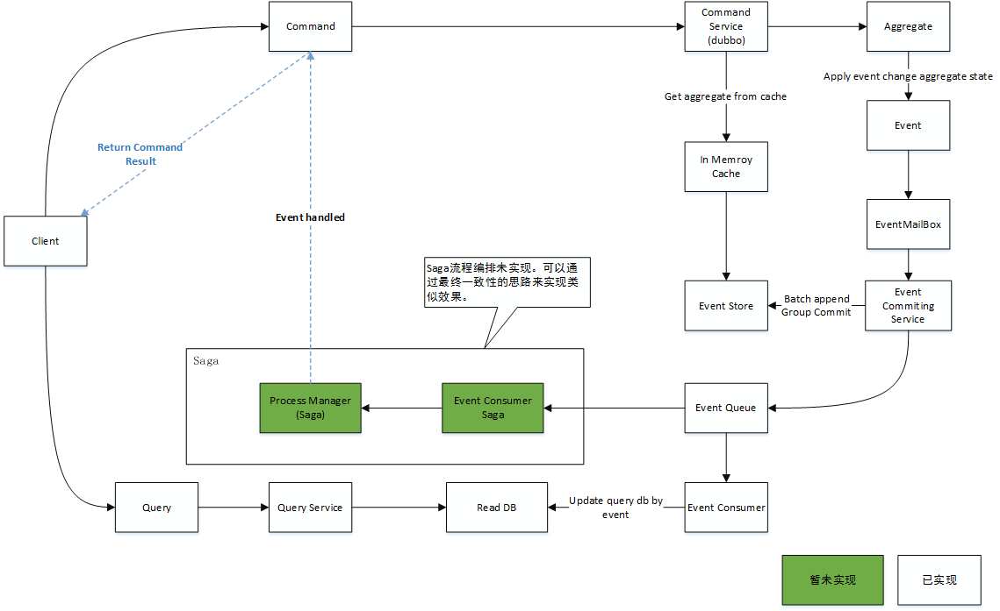

### cqrs

cqrs是基于事件回溯的高性能架构，主要针对领域业务高度复杂且需要高性能的业务场景，可以说它能够作为高并发系统的通用解决方案。例如：秒杀、抢红包、12306卖票等。基于事件溯源，实现cqrs最复杂的模型，
通过事件是追加的特性，然后结合事件批量提交的手段，避免在高并发更新时多个线程update带来的严重锁冲突问题，从而来实现高性能。
支持聚合回溯，包括扩容、缩容聚合冲突事件回溯、聚合根在内存、聚合根快照、聚合事件组提交，可集成dubbo、spring cloud。注意：并未支持saga业务编排，由业务方自己去编排。

### 架构概述

### 使用示例：

//1.初始化商品库存管理服务

GoodsStockService service = new GoodsStockService(committingService);

//2.初始化商品

GoodsAddCommand command = new GoodsAddCommand(IdWorker.getId(), 2, "iphone 6 plus", 1000);

Goods goods1 = service.process(command, () -> new Goods(2, command.getName(), command.getCount())).join();

//3.库存+1

GoodsStockAddCommand command = new GoodsStockAddCommand(IdWorker.getId(), 2);

Goods goods2 = service.process(command, goods -> goods.addStock(1)).join();

### 注意事项

1.如果使用dubbo、spring cloud负载均衡策略请选择一致性hash，这样可以减少在集群扩容、缩容聚合根回溯的成本。

2.关闭dubbo、spring cloud的失败重试。

3.Dubbo服务抛出该异常AggregateEventConflictException，客户端可以重新发起请求。(
出现此异常的原因是当前聚合根在多个实例中存在（集群扩容时），可以捕获此异常然后重新在client发起调用，当前的请求会负载到新的实例上。)

4.mysql 需要开启 rewriteBatchedStatements 批量操作选项，否则性能不佳。

### 测试报告

CPU:I7-3740QM（4核8线程） 24G内存 mysql 5.7 ssd(早期固态硬盘)  jdk1.8

性能数据：

商品添加：6.5K TPS/s

单个商品库存添加：14K TPS/S

三个商品库存添加：30K TPS/S mysql cpu：18% mysql内存占用：300M ， jvm cpu: 20% jvm 内存占用：1.8G 

